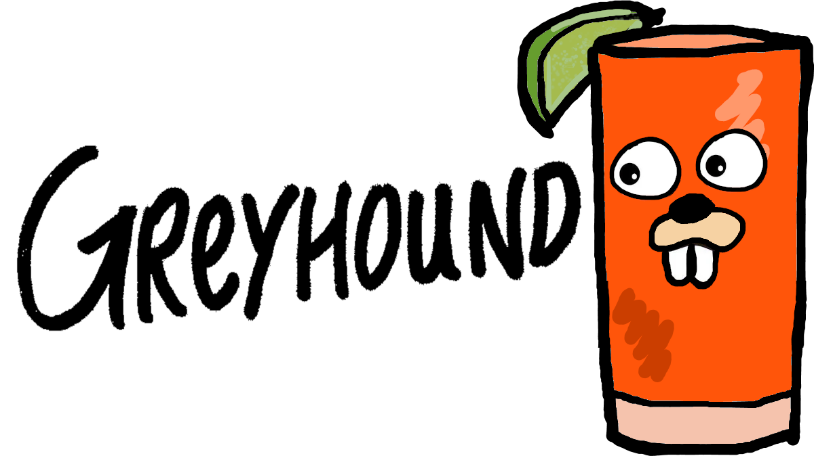

Greyhound (noun): Something fast, at least ostensibly, like the dog or the bus line, or drank fast, like the cocktail.

The Greyhound first appeared in the Savoy Cocktail Book. Shake:

- 1 part [gin](https://github.com/gin-gonic/gin)
- 4 parts [grapefruit juice](https://github.com/vuejs/)
- Ice

Strain into a highball. Garnish with a lime or a lemon. Salt the rim for a Salty Dog.

## Motivation

I've extensively used [Laravel](https://github.com/laravel/laravel) alongside [Inertia](https://github.com/inertiajs/inertia) to flexibly build modern web applications with
an expressive and powerful server side and a single-page application client side with React and Vue. Done tastefully, this allows you to engage in anything from progressively enhanced
websites to full-stack apps without the need for writing an API or using Node-ecosystem libraries for data retrieval.

This approach is excellent and I want to copy it. I also want to help develop the ecosystem for web application development with Go, which presents a unique opportunity to encapsulate
web apps within the standard library server functionality of Go (web servers being the canonical Go app) to make it easier for both raw deployments (just huck the binary onto a server
and run it) and containerized, cloud-native approaches, no Apache or Nginx required. The Go ecosystem gives us access to so many tools to make development, deployment, and CI/CD so much
easier, so let's (try) to use them.

## Links

- [Blog](https://kylemetscher.com)
- [LinkedIn](https://www.linkedin.com/in/c0w80yd4n)
- [Renee French's gopher](https://go.dev/blog/gopher)
- [IPChicken](https://ipchicken.com)
